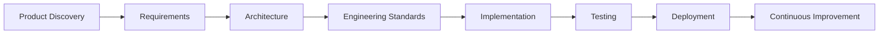

---

document:
id: GF-PF-000
title: Project Overview
category: Project Foundation
version: 1.0.0
status: Approved
owner: GiveFlow India Project

lifecycle:
created: 2026-07-08
last_updated: 2026-07-08
next_review: 2026-10-08

dependencies:
requires:
- README.md
- CONTRIBUTING.md
- 07_AI_Guidelines/51_AI_Development_Manifest.md

referenced_by:

* 01_Product_Discovery.md
* 02_Product_Vision.md
* 03_Business_Model.md
* 04_Goals_and_Success_Metrics.md
* 05_Product_Roadmap.md
* 06_Functional_Requirements.md
* 13_System_Architecture.md

approval:
product_owner: Pending
technical_architect: Pending

ai:
importance: Critical
context_priority: Highest
-------------------------

# Project Overview

## Executive Summary

GiveFlow India is an enterprise-grade, multi-tenant Software-as-a-Service (SaaS) platform designed to modernize donation management and statutory compliance for Indian Non-Governmental Organizations (NGOs), charitable trusts, foundations, educational institutions, and other eligible nonprofit organizations.

The platform enables organizations to securely collect online donations, manage donor relationships, automate operational workflows, prepare statutory compliance data, and integrate a professional donation experience into existing websites through an embeddable widget.

This repository contains the complete product, engineering, architectural, security, and operational blueprint required to build and maintain the platform.

It is intended to serve as the authoritative reference for product owners, software engineers, designers, security reviewers, DevOps engineers, QA teams, and AI-assisted development tools such as Google AI Studio.

---

# Vision Statement

To become India's most trusted and comprehensive digital donation infrastructure platform, empowering nonprofit organizations with modern technology that simplifies fundraising, improves donor engagement, and streamlines compliance.

---

# Mission Statement

Provide NGOs with a secure, scalable, and intelligent platform that enables them to:

* Accept donations through a seamless digital experience.
* Build long-term donor relationships.
* Automate repetitive administrative work.
* Improve transparency and accountability.
* Prepare statutory compliance information efficiently.
* Scale fundraising operations without increasing operational complexity.

---

# Project Purpose

The purpose of GiveFlow India is to replace fragmented and manual donation workflows with a unified, cloud-native platform designed specifically for the operational realities and regulatory requirements of Indian nonprofit organizations.

The project follows a documentation-first engineering methodology, ensuring that every feature is specified, reviewed, and approved before implementation begins.

---

# Business Context

Many nonprofit organizations rely on multiple disconnected tools for:

* Online donations
* Payment reconciliation
* Donor databases
* Receipt generation
* Annual reporting
* Tax documentation
* Communication with donors

These fragmented processes introduce operational inefficiencies, duplicate work, inconsistent donor experiences, and increased compliance risk.

GiveFlow India addresses these challenges by providing a single integrated platform that combines fundraising, donor management, compliance preparation, analytics, and developer-friendly integration capabilities.

---

# Product Scope

## In Scope

The first major release of GiveFlow India is expected to include:

### Organization Management

* Organization registration
* Organization onboarding
* Team management
* Branding configuration
* Organization settings

### Donation Management

* One-time donations
* Campaign donations
* Donation tracking
* Payment reconciliation
* Donation receipts

### Donor Relationship Management

* Donor profiles
* Donation history
* Communication history
* Tax documentation
* Donor portal

### Campaign Management

* Campaign creation
* Fundraising goals
* Campaign analytics
* Public campaign pages

### Payment Integration

Primary payment gateway:

* Razorpay

Future integrations will follow a provider-based architecture.

### Compliance Support

The platform will support workflows related to:

* Section 80G
* Section 12A
* DARPAN registration
* CSR information
* Form 10BD preparation
* Form 10BE generation after authorized filing

The platform prepares and manages compliance workflows but does not assume direct electronic filing capability unless officially supported by government interfaces.

### Reporting

* Operational dashboards
* Donation analytics
* Financial summaries
* Campaign performance
* Donor insights

### Widget Platform

Organizations will be able to generate a configurable JavaScript donation widget that can be embedded into existing websites with minimal integration effort.

---

# Out of Scope

The following capabilities are not part of the initial release:

* Direct government filing of statutory forms without officially supported APIs.
* Accounting software replacement.
* ERP replacement.
* Payroll management.
* Volunteer management.
* Mobile applications.
* Marketplace integrations.

These capabilities may be considered in future roadmap phases.

---

# Strategic Objectives

The project is guided by the following strategic objectives:

1. Reduce administrative workload for NGOs.
2. Improve donor experience.
3. Increase transparency.
4. Support compliance preparation.
5. Enable rapid website integration.
6. Deliver enterprise-grade security.
7. Build a scalable SaaS platform.
8. Support future ecosystem integrations.
9. Establish a reusable platform architecture.
10. Enable AI-assisted product evolution.

---

# Target Audience

## Primary Users

* Registered NGOs
* Charitable Trusts
* Educational Trusts
* Foundations
* Religious Organizations

## Secondary Users

* Individual Donors
* Corporate CSR Teams
* Finance Officers
* Auditors
* Volunteers

## Internal Platform Users

* Platform Administrators
* Customer Success Teams
* Technical Support Teams
* Operations Teams

---

# Guiding Principles

The project is governed by the following principles:

* Documentation First
* Architecture Before Implementation
* Multi-Tenant by Default
* Security by Design
* Compliance by Design
* API First
* Modular Architecture
* AI-Assisted, Human-Governed Development
* Scalability by Default
* Developer Experience Matters

Detailed explanations of these principles are maintained in `99_Context/Project_Principles.md`.

---

# Product Success Criteria

The project will be considered successful when it demonstrates:

### Business Success

* Organizations can onboard independently.
* Donation collection is reliable.
* Administrative effort is reduced.
* Donor satisfaction improves.
* Compliance preparation becomes more efficient.

### Technical Success

* High availability.
* Secure multi-tenant isolation.
* Well-documented APIs.
* Maintainable architecture.
* Consistent engineering standards.
* Automated testing coverage.
* Production-ready deployment processes.

---

# Stakeholders

## Internal

* Product Owner
* Technical Architect
* Engineering Team
* UI/UX Team
* QA Team
* DevOps Team

## External

* NGOs
* Donors
* Payment Providers
* Compliance Advisors
* Regulatory Authorities
* Integration Partners

---

# Assumptions

The project currently assumes:

* Organizations possess valid registration details required for onboarding.
* Organizations are responsible for the accuracy of statutory information they provide.
* Payment processing is delegated to approved payment gateway providers.
* Regulatory requirements may evolve and must be accommodated through versioned compliance modules.

---

# Risks

Potential project risks include:

* Regulatory changes affecting compliance workflows.
* Payment gateway API changes.
* Security vulnerabilities.
* Data privacy obligations.
* Scalability challenges as tenant count grows.
* AI-generated implementation inconsistencies if documentation is not maintained.

Mitigation strategies will be documented in dedicated architecture and risk management documents.

---

# Dependencies

This document depends on:

* README.md
* CONTRIBUTING.md
* AI Development Manifest

Future documents deriving from this overview include:

* Product Discovery
* Product Vision
* Business Model
* Functional Requirements
* System Architecture
* Database Architecture
* API Architecture

---

# Project Lifecycle

---

# Revision History

| Version | Date       | Description                       |
| ------- | ---------- | --------------------------------- |
| 1.0.0   | 2026-07-08 | Initial Project Overview created. |

---

# Approval Criteria

This document is considered approved when:

* Product scope has been validated.
* Stakeholders agree with the strategic direction.
* Repository governance is established.
* The AI Development Manifest references this document.
* Subsequent Product Discovery documentation aligns with this overview.

---

# Next Document

The next document in the Project Foundation is:

**`00_Project_Foundation/01_Product_Discovery.md`**

This document expands the executive overview into a detailed product discovery exercise covering market analysis, problem validation, stakeholder research, competitive landscape, product positioning, business opportunities, assumptions, and the long-term product strategy that will drive all future engineering decisions.
